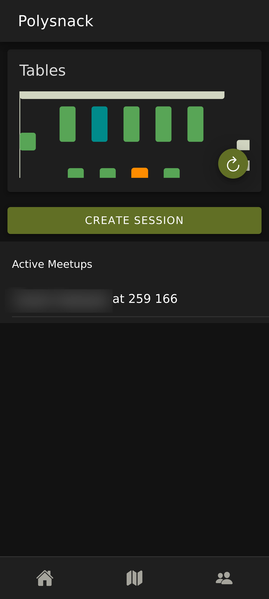
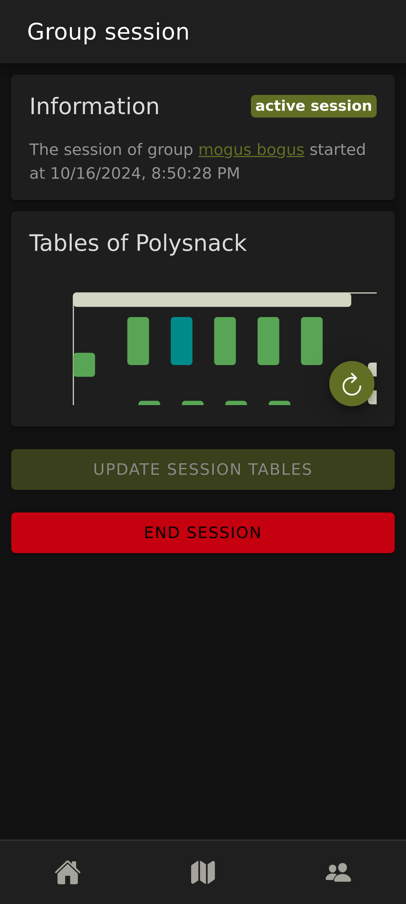
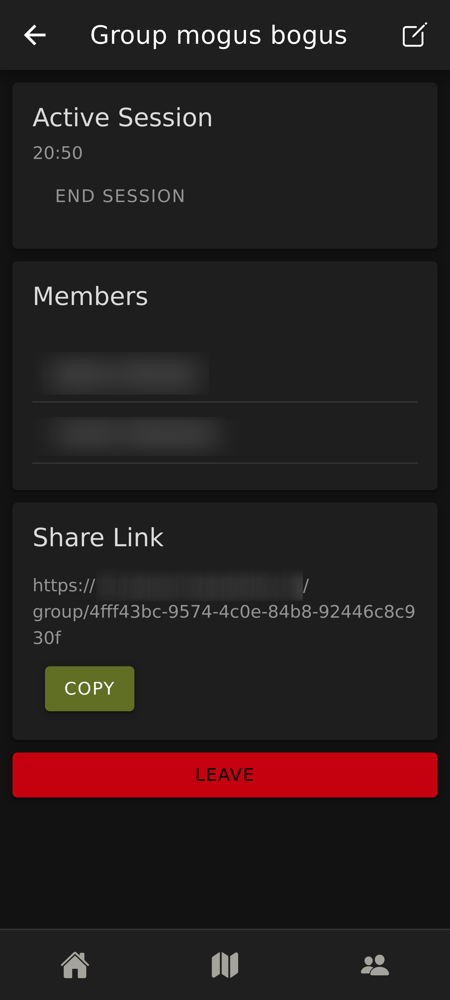
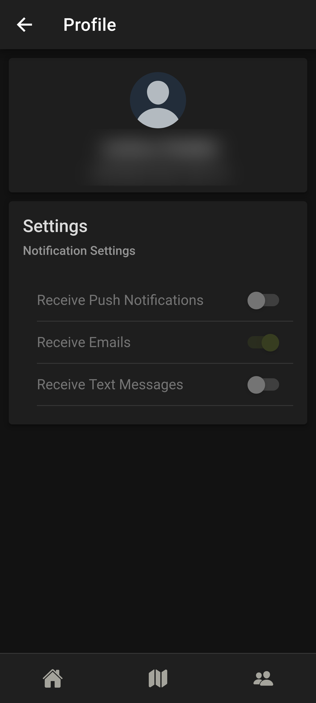

# VISCon Hackathon 2024
This repository contains the project created by team **olive zebra** at the VISCon Hackathon at ETH-Zurich hosted in the autumn of 2024.

## Idea & Constraints
The goal of this hackathon was to implement a proposed project idea as a web-application. The authorization of users would be taken care of by a reverse proxy already set up. The Idea for this project was to have a (web-)app to coordinating eating at the various mensas at ETH. The feature set schould include:

- Creation of Groups to share table location with.
- Coordinating eating times with a group.
- A convenient way to find other people looking for someone to talk whilst eating.
- Simple and easy to use way to enter the location of a given table.

## Implemented Features
We managed to implement the following features in the 42h timeframe:
- Creation of groups and invitation through invite links
- Selection of a table via QR Code at that table
- Display of the relevant Table in a generated SVG (can also be used as a selection fallback)
- User can host a "meetup" which is public and other people can go to
- Map to see the location of all the mensas
- Automatic generation of QR Codes for tables with fancy map background
- E-Mail notifications for session creation and start

## Screenshots
<p float="left">




</p>

## Tech Stack
The project was realized using the following technologies:
- Frontend in React using Ionic
- Backend using Java Spring Boot
- MariaDB as a database
- Microservice in Python for SVG generation
- Deployment via Docker

## Deployment
This is an **example** deployment for future reference. Note that this deployment is not complete as the authorization needs to be managed by a reverse proxy (see [AuthInterceptor.java](https://github.com/VirtCode/viscon-2024/blob/main/backend/src/main/java/ch/olivezebra/mensa/auth/AuthInterceptor.java) for header names). Also note that traefik is used as an *internal* reverse proxy.

```yml
services:

  backend:
    image: ghcr.io/virtcode/viscon-2024-backend:main
    restart: always
    labels:
      traefik.enable: true
      traefik.http.routers.backend.entrypoints: web
      traefik.http.routers.backend.rule: PathPrefix(`/api`)
      traefik.http.services.backend.loadbalancer.server.port: 80

      traefik.http.routers.backend.middlewares: backend-strip-prefix
      traefik.http.middlewares.backend-strip-prefix.stripprefix.prefixes: /api
    environment:
      SERVER_PORT: 80

      SPRING_DATASOURCE_URL: jdbc:mariadb://database/hackathon
      SPRING_DATASOURCE_USERNAME: hackathon
      SPRING_DATASOURCE_PASSWORD: ${DATABASE_PASSWORD}

      FRONTEND_QR: ${FRONTEND_URL}/qr/
      FRONTEND_SESSION: ${FRONTEND_URL}/session/

      AUTH_IMPERSONATE: false # enable to use the api unprotected
      MICROSERVICES_LAYOUT_HOST: http://map-gen:4444

      SPRING_MAIL_HOST: ${MAIL_SERVER}
      SPRING_MAIL_PORT: ${MAIL_PORT}
      SPRING_MAIL_USERNAME: ${MAIL_USERNAME}
      SPRING_MAIL_PASSWORD: ${MAIL_PASSWORD}

      MAIL_NAME: Meet2Eat
      MAIL_SENDER: ${MAIL_SENDER}

      SPRINGDOC_SWAGGER-UI_DISABLE-SWAGGER-DEFAULT-URL: true

  frontend:
    image: ghcr.io/virtcode/viscon-2024-frontend:main
    restart: always
    labels:
      traefik.enable: true
      traefik.http.routers.frontend.entrypoints: web
      traefik.http.routers.frontend.rule: PathPrefix(`/`)
      traefik.http.services.frontend.loadbalancer.server.port: 80

  map-gen:
    image: ghcr.io/virtcode/viscon-2024-microservice-map:main
    restart: always

  database:
    image: mariadb:latest
    restart: always
    environment:
      MARIADB_RANDOM_ROOT_PASSWORD: yes
      MARIADB_ROOT_HOST: localhost
      MARIADB_DATABASE: hackathon
      MARIADB_USER: hackathon
      MARIADB_PASSWORD: ${DATABASE_PASSWORD}
```
